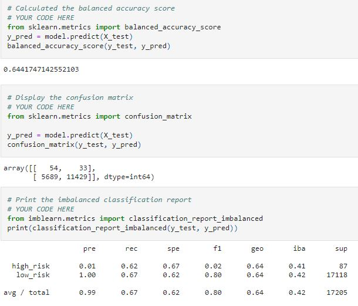
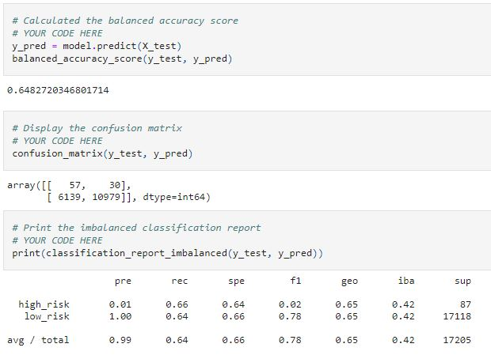
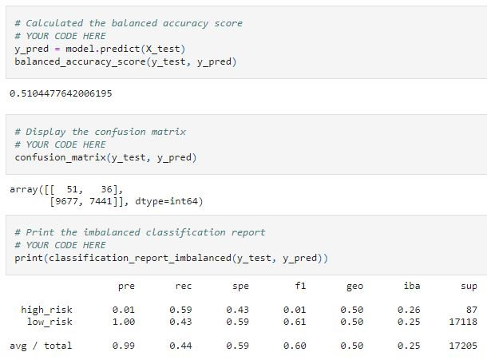
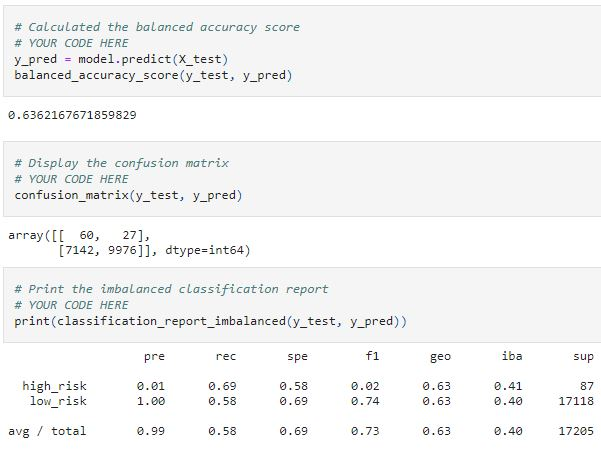
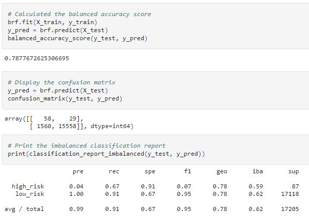
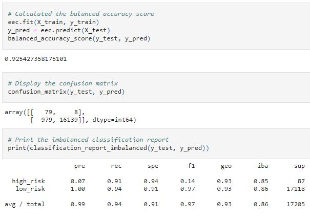

# Credit_Risk_Analysis
Module 17 

Files:  [credit_risk_ensemble.ipynb](credit_risk_ensemble.ipynb)  [credit_risk_resampling.ipynb](credit_risk_resampling.ipynb)  [credit_risk_ensemble.html](Resources/credit_risk_ensemble.html)  [credit_risk_resampling.html](Resources/credit_risk_resampling.html) 

## Overview of the analysis:
Explain the purpose of this analysis is to demonstrate resampling models using machine learning imbalanced-learn and scikit-learn to predit Credit Risk, using techniques of RandomOverSampler, SMOTE (Synthetic Minority Oversampling Technique), ClusterCentroids (under sampling), and then SMOTEENN (SMOTE and Edited Nearest Neighbors (ENN)), and then finally Ensemble Classifiers BalancedRandomForestClassifier and EasyEnsembleClassifier to predict Credit Risk

## Results:

   ### RandomOverSampler

    * Accuracy Score: .644
    * Precision - High Risk: 0.01
    * Precision - Low Risk:  1.00
    * Recall    - High Risk: 0.62
    * Recall    - Low Risk:  0.67

   ### SMOTE

    * Accuracy Score: .648
    * Precision - High Risk: 0.01
    * Precision - Low Risk:  1.00
    * Recall    - High Risk: 0.66
    * Recall    - Low Risk:  0.64

   ### ClusterCentroids

    * Accuracy Score: .510
    * Precision - High Risk: 0.01
    * Precision - Low Risk:  1.00
    * Recall    - High Risk: 0.59
    * Recall    - Low Risk:  0.43

   ### SMOTEENN

    * Accuracy Score: .636
    * Precision - High Risk: 0.01
    * Precision - Low Risk:  1.00
    * Recall    - High Risk: 0.69
    * Recall    - Low Risk:  0.58

   ### BalancedRandomForestClassifer

    * Accuracy Score: .788
    * Precision - High Risk: 0.04
    * Precision - Low Risk:  1.00
    * Recall    - High Risk: 0.67
    * Recall    - Low Risk:  0.91

   ### EasyEnsembleClassifier

    * Accuracy Score: .925
    * Precision - High Risk: 0.07
    * Precision - Low Risk:  1.00
    * Recall    - High Risk: 0.91
    * Recall    - Low Risk:  0.94

## Summary:
The results show that the Sensitivity (recall) of EasyEnsembleClassifier for both low and High Risk is over .90, which is most desirable and is balanced out by the F1 (harmonic mean score of .97 (2(Precision * Sensitivity)/(Precision + Sensitivity)). Therefore we can best assert that Bag of balanced boosted learners also known as EasyEnsemble is the most preferred method for the highest accuracy scoring
